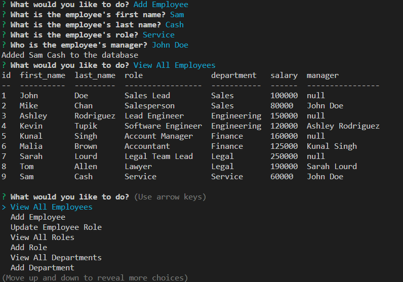
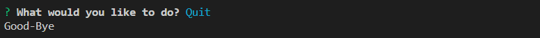

# Employee Tracker

## Licensing:

## Table of Contents
- [User Story](#user-story)
- [Description](#description)
- [Installation](#installation)
- [Usage](#usage)
- [License](#license)
- [Contributing](#contributing)
- [Tests](#tests)
- [Questions](#questions)

## User Story:
AS A business owner

I WANT to be able to view and manage the departments, roles, and employees in my company

SO THAT I can organize and plan my business

## Description:
This is an employee tracker database created in the UW Coding Bootcamp. It allows users to input departments, roles, and employees, update an employee's role, and view a table of departments, roles, and employees.

## Installation:
- Download it through Github
- Ensure inquirer is installed
- Ensure mysql2 is installed
- Ensure console.table package is installed
- To connect to the database, once files are downloaded to you computer, you will need to change the password on line 11 of the server.js file to your own password

## Usage:
- Open terminal and navigate to employee_tracker folder
- Type npm init -y into terminal to create a new .json file
- Type npm i into terminal
- Type npm i inquirer into terminal
- Type npm i mysql2 into terminal
- Type npm i console.table into terminal
- Navigate to the db folder
- Type mysql -u root -p into terminal
- Enter your password into terminal
- Type source schema.sql into terminal
- Type source seeds.sql into terminal
- Type quit into terminal
- Navigate back to the the employee_tracker folder in terminal
- Type npm start into the terminal
- Answer prompts in terminal to view, add, and update the database

Link to Video of Walkthrough for Demonstration:

https://youtu.be/6G3ubKlC82c 

Screenshots:

## License:
MIT

## Contributing:
Contributions are welcome through forking my repository.

## Tests:
None

## Questions:
- Github: [andreahergert](https://github.com/andreahergert)
- Email: ahergert24@hotmail.com 